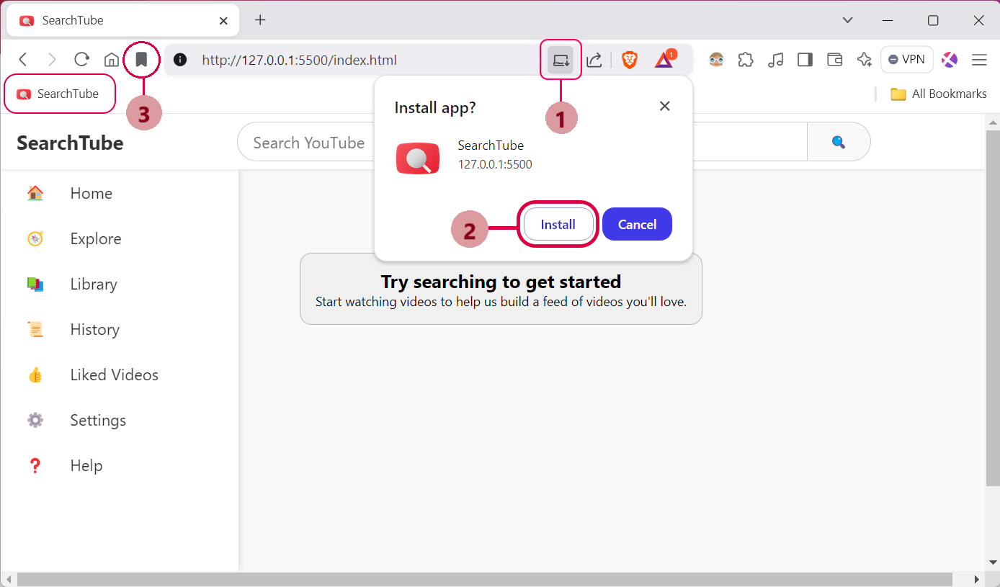
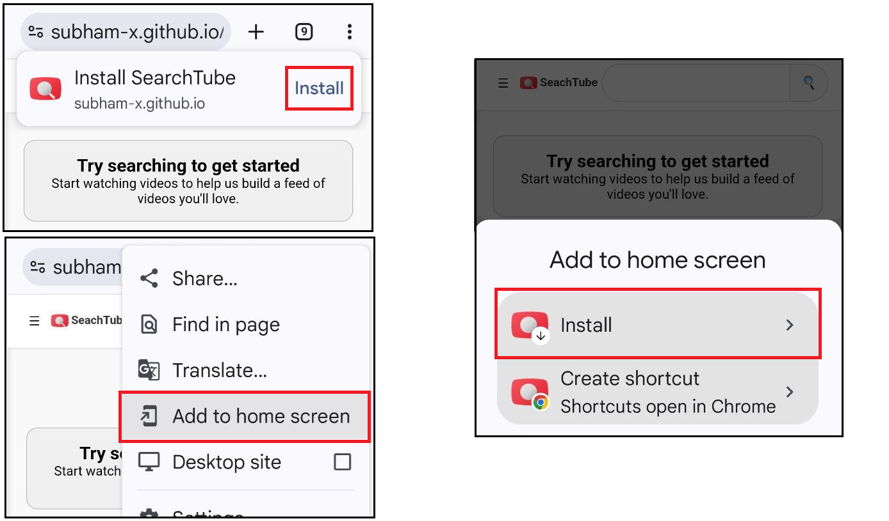

# **YouTubeDistractionFree**[🔗](https://github.com/Subham-x/FocusYT)
🎯 [SearchTube🔗](https://subham-x.github.io/FocusYT/) is a clean, minimalist YouTube homepage to help you stay focused during search by removing distracting video suggestions.

> **How to Use it?**
1. First go to [Search Youtube website](https://subham-x.github.io/FocusYT/) (YouTube Distraction Free Homepage) and then do as follows: 
   - ⬇️ "Install site as app" (**PWA**: Progressive web app)
   - ⭐**Bookmark** this site.
   - 📌 **Pin to home page** of web browser.

---

## 🚀 **Introduction**  
- ✨ **Purpose**: Avoid distractions from the YouTube homepage.  
- 🎯 **Focus**: Stream videos without being overwhelmed by suggestions.  
- 🔥 **Why?**: Productivity and focus matter!

---

## 🌟 **Demo**  
> **Experience it live**: [View Demo](https://subham-x.github.io/FocusYT/)


---

## ⚡ **Features**  
- 🔎 Focused **distraction free** search functionality.  
- 📜 Clean and minimal interface.  
- ❌ No homepage distractions, no autoplay videos.  
- 📱 Mobile-friendly and responsive design.  

---

Got it! Based on your updated instructions, here’s how the **Installation** section can be updated to reflect the PWA installation process:

---

## 🛠️ **Installation**  

To install **YouTubeDistractionFree** website 🌐 as a Progressive Web App (PWA) and enjoy a distraction-free YouTube experience:

1. **Go to the website**:  
   Visit the [SearchTube Online website](https://subham-x.github.io/FocusYT/) in your browser.

2. **Install as App**:  
   - On **Chrome** or **Edge**: Click on the **"Install"** button in the browser’s address bar (usually a "+" icon or "Install" button).  
   - On **Firefox**: Click the menu button (three dots) in the top right corner and select **"Install YouTubeDistractionFree"**.

        -  

3. Also **bookmark** this site on your bookmark bar to access it faster.
3. **Enjoy!**  
   Once installed, you can open it directly from your home screen like a native app.

---

## 💡 **Creator & Credits** 
- **Creator**: [Subham Kumar Sathua](https://github.com/Subham-x)
- **Inspired by**: The need for a focused YouTube experience.
- **Live Website**: [Open and install PWA website]([link](https://subham-x.github.io/FocusYT/)
- **GitHub Repo**: [YouTubeDistractionFree]([link](https://github.com/Subham-x/FocusYT)

- **Credits**: Thanks to everyone contributing to the open-source community for their constant inspiration!

---

## ⚖️ **License**  
This project is licensed under the [Apache 2.0 License](./LICENSE):  
- You are free to use, modify, and distribute this project.  
- You must provide **attribution** to the original author.  
- The author is **not liable** for any misuse or violations of third-party terms.  

---

## 🤝 **Contribution Guide**  
Contributions are welcome! Follow these steps:  
1. Fork the repository.  
2. Create a new branch:  
   ```bash
   git checkout -b feature-branch
   ```  
3. Make changes and commit:  
   ```bash
   git commit -m "Add feature"
   ```  
4. Push your branch and open a pull request:  
   ```bash
   git push origin feature-branch
   ```  

---

## ❗ **Disclaimer**  
The author is **not responsible** for:  
- Any misuse of this project.  
- Violations of YouTube’s terms of service.  
- Consequences arising from modifications made by others.  

---

## 📞 **Contact**  
💌 Have questions or feedback? Reach out!
- 📧 Email Main: [subhamsathua@outlook.com](mailto:subhamsathua@outlook.com)  
- 📧 Email: [subhamsathua@protonmail.com](mailto:subhamsathua@protonmail.com)
- 🐦 Twitter: [@Subham_Sathua](https://x.com/Subham_Sathua)
- 👉 🔗 LinkedIn: [@subhamsathua](https://www.linkedin.com/in/subhamsathua/)

---
